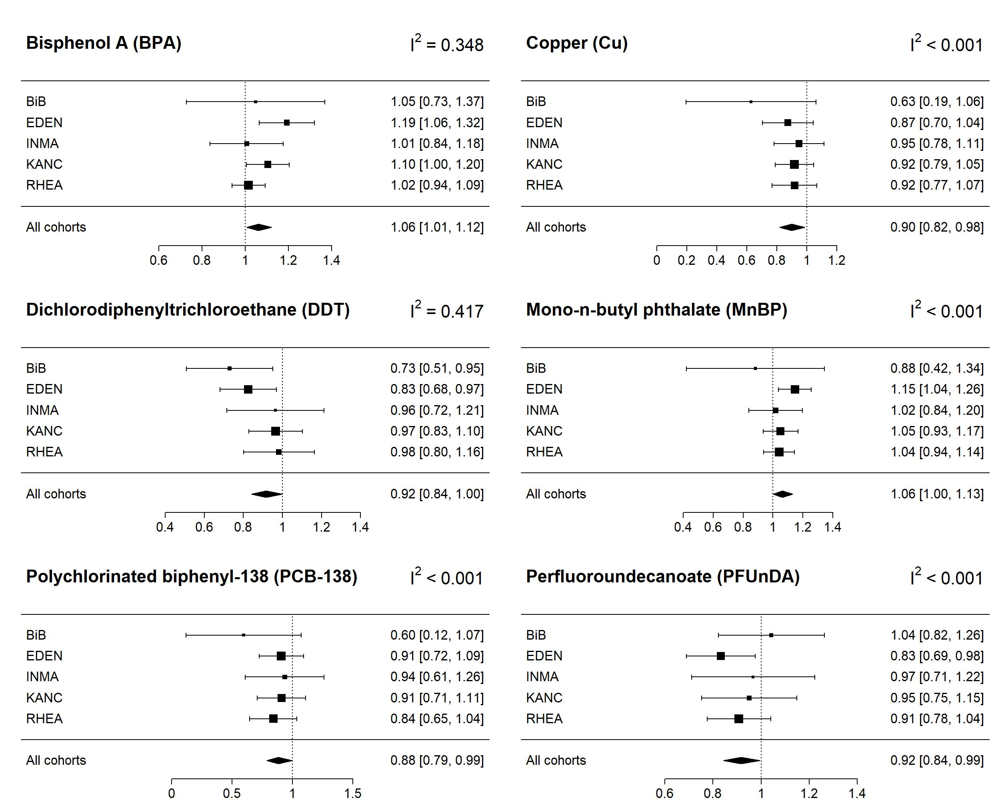
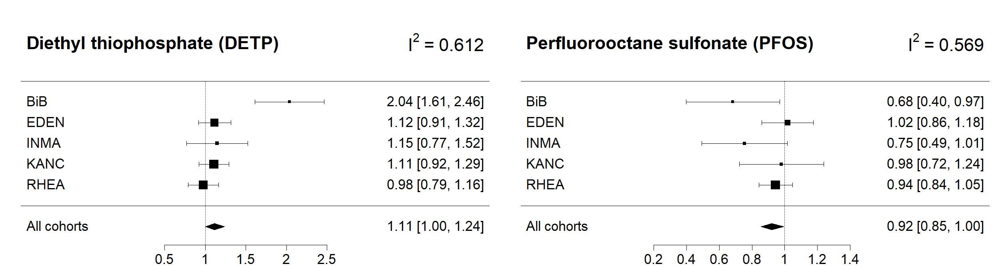
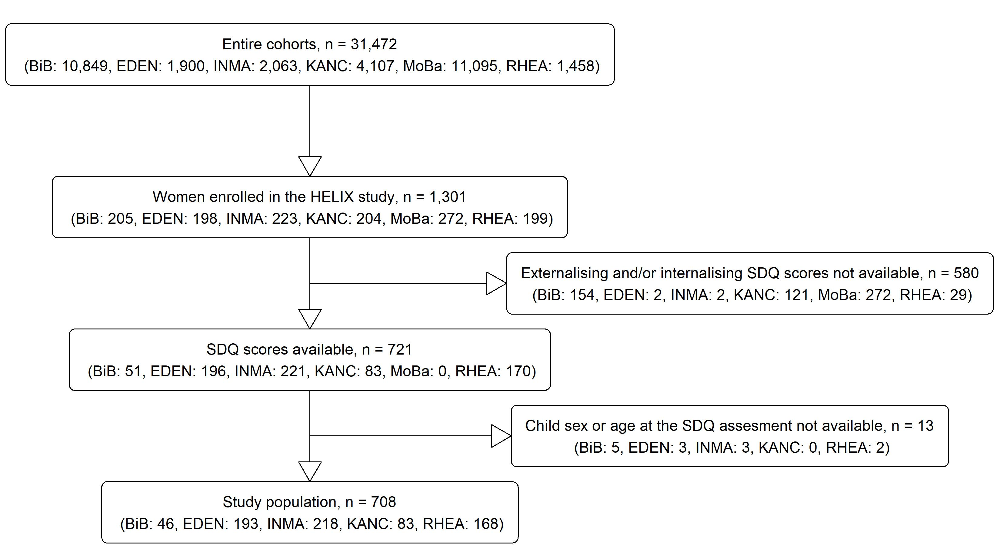
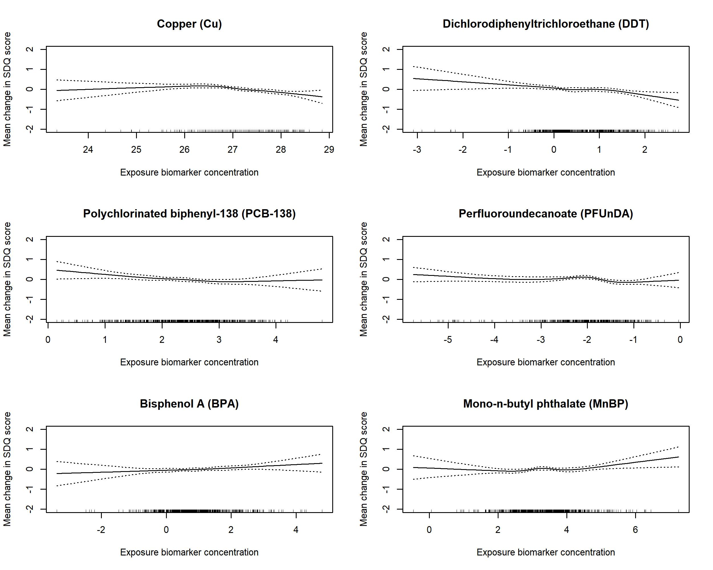
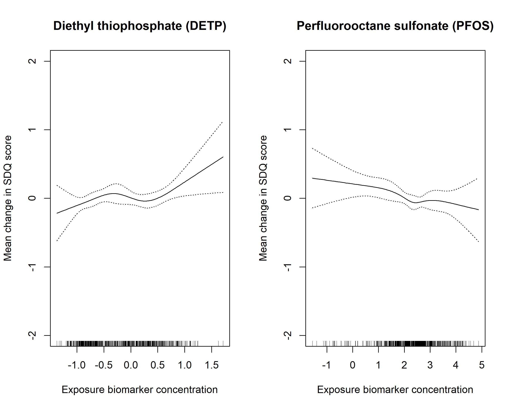

## **General setup**

```{r setup, echo = TRUE, include = FALSE}
knitr::opts_chunk$set(echo = TRUE, include = TRUE, message = FALSE, warning = FALSE)
```


```{r path setup}
# Create a path to save output files
path_main <- "results/main_analyses"
path_suppl <- "results/supplementary_analyses"
```


## **Load packages**

```{r load packages}
# Load packages
library(Hmisc)
library(magrittr)
library(MASS)
library(mice)
```


## **Load datasets**

Note: re-running the analyses requires an additional data/raw_data folder not shared here, containing the different data sets presented hereafter. These data can only be provided upon request.

```{r load datasets}
# Load dataset containing exposures and SDQ scores data
exposure_data <- readr::read_csv(file = here::here("data/raw_data/SDQ_biomarkers_july_2018.csv"))

# Load dataset containing covariates data
load(file = here::here("data/raw_data/20180212_v2_3_ImputedDataset_20x10_AllDataFrame.Rdata"))
covariate_data <- imp.df.v2.3
rm(imp.df.v2.3)

# Load dataset containing sex and age of the children
sex_age_data <- utils::read.csv(file = here::here("data/raw_data/INMA_EDEN_KANK_RHEA_BIB_SDQ_2018_07.csv"), stringsAsFactors = TRUE)
```


## **Prepare variable lists**

Manually created lists of compounds, models variables, etc.

```{r manually create lists of variables}
# List of covariates names
covariates_list <- c("smoking", "mother_bmi", "mother_age", "mother_edu", "parity", "breastf_cat", "mother_work", "child_age", "weight_gain", "weight_gain_cat", "fish_intake", "conception_trim", "crowding", "year_birth", "sex")

# List of variables that will be compared between cohorts
covariates_to_compare_by_cohort <- c("cohort", "conception_trim", "smoking", "parity", "mother_edu", "mother_work", "mother_bmi", "weight_gain_cat", "sex", "child_age", "mother_age", "h_sdq_external", "h_sdq_internal")

# List of adjustment factors used in statistical analyses
conf_list <- c("cohort", "smoking", "mother_bmi", "mother_age", "mother_edu", "parity", "conception_trim", "mother_work", "child_age", "sex")

# List of variables to be adjusted for fat
fat_adjust <- c("dde", "ddt", "hcb", "pbde47", "pbde153", "pcb118", "pcb138", "pcb153", "pcb170", "pcb180")

# List of variables to be adjusted for creatinine
creatinine_adjust <- c("mep", "mibp", "mnbp", "mbzp", "mehp", "mehhp", "meohp", "mecpp", "ohminp", "oxominp", "mepa", "etpa", "prpa", "bpa", "bupa", "oxbe", "trcs", "dmp", "dmtp", "dmdtp", "dep", "detp", "cotinine")

# List of variables to be log2 transformed
log2_transform <- c("pfoa", "pfna", "pfunda", "pfhxs", "pfos", "k", "mg", "na", "as", "cd", "co", "cs", "cu", "hg", "mn", "mo", "pb", "se", "zn")

# List of variables to be ln transformed
ln_transform <- "hs_cotinine_adj"

# Load of original names of exposures along with short names of compounds and family name (ending with _m)
variable_list_m <- readr::read_csv(file = here::here("data/variable_lists/variable_list_m.csv"))

# List of exposure variables that will be used for regressions and other analysis, adjusted, log and IQR transformed (ending with _adj_log_iqr)
variable_list_adj_log_iqr <- readr::read_csv(here::here("data/variable_lists/variable_list_adj_log_iqr.csv"))

# List of exposure variables from OC family only
variable_list_oc <- dplyr::filter(variable_list_adj_log_iqr, Variable_name %in% c("hs_dde_adj_log2_iqr", "hs_ddt_adj_log2_iqr", "hs_hcb_adj_log2_iqr", "hs_pcb118_adj_log2_iqr",  "hs_pcb138_adj_log2_iqr", "hs_pcb153_adj_log2_iqr", "hs_pcb170_adj_log2_iqr", "hs_pcb180_adj_log2_iqr"))
```

```{r manually create lists of variables needed in imputation}
# Variables used in multiple imputation
# The lists contain all the variables that will be treated specially during imputation (variables that will not be predictors, highly correlated variables, low predictability variables, skipped from imputation but not from prediction, creatinine adjusted, total fat percentage adjusted, not adjusted but log2 transformed)

# List variables that are highly correlated with each other
high_corr <- c("pcb118", "pcb138", "pcb153", "pcb170", "pfos", "pfoa", "pfunda", "mnbp", "mibp", "mehhp", "meohp", "mecpp", "etpa", "mepa", "dmtp")
high_corr_short <- c("pfos", "pfoa", "pfunda")
high_corr_dehp <- c("dehp_sum_m", "dehp_sum_adj_log2")

# List variables with low potential for prediction in imputation
low_pred <- c("ddt", "pbde47", "pbde153", "as", "k", "mg", "na", "cd", "co", "cs", "cu", "mn", "mo", "pb", "se", "zn", "ohminp", "oxominp")
low_pred_short <- c("ddt", "pbde47", "pbde153", "ohminp", "oxominp")

# List variables that will not be considered as predictors in imputation
no_pred <- c("HelixID", "year_birth")

# List variables to be skipped from imputation but not from prediction
skip <- c("HelixID", "h_sdq_external", "h_sdq_internal", "cohort", "child_age", "sex", "year_birth")
```


=================================


## **Data preparation**

Before further analyses, original datasets need to be pre-processed: variables of interest need to be selected, some variables need to be renamed and recoded, missing values removed or imputed, datasets merged etc.    

We divided urinary biomarker concentrations by creatinine concentration. Haemal lipophilic biomarker concentrations were standardized and expressed in ng/g of total lipids in serum or plasma. Concentrations were then ln-transformed (cotinine) or log2-transformed (all other biomarkers) to approach normality and standardized for the interquartile range (IQR) by dividing exposure concentration observed for each individual for a given exposure by the IQR calculated for this exposure.

```{r prepare datasets for further processing}
# Merge all original datasets (exposures, SDQ scores, covariates) in one dataset.
# This operation will limit the number of subjects to those with complete SDQ scores, child age and sex. It will rename covariates of interest and create weight gain and DEHP sum variables.
sdq_expo_cov_datasets <- PrepareData::PrepareDatasets(exposure_data = exposure_data,
                                                      covariate_data = covariate_data,
                                                      covariates_list = covariates_list,
                                                      sex_age_data = sex_age_data,
                                                      fat_adjust = fat_adjust,
                                                      creatinine_adjust = creatinine_adjust,
                                                      log2_transform = log2_transform,
                                                      ln_transform = ln_transform)

# 4 datasets will be created: exposures with LOD status (exposures_description), exposures with concentration values (exposures_concentrations), combined dataset of covariates and SDQ and exposures (sdq_expo_cov) and a combined dataset with SDQ, exposures fat/creat adjusted and log transformed and covariates (sdq_expo_adj_log_cov)

# Save datasets into global environment
exposures_description <- sdq_expo_cov_datasets$exposures_description
exposures_concentrations <- sdq_expo_cov_datasets$exposures_concentrations
sdq_expo_cov <- sdq_expo_cov_datasets$sdq_expo_cov
sdq_expo_adj_log_cov <- sdq_expo_cov_datasets$sdq_expo_adj_log_cov

rm(sdq_expo_cov_datasets)
```

=================================

## **Imputation of missing data**

Missing data for exposure biomarker concentrations and adjustment factors were multiply imputed (100 imputed datasets) via a chained equations algorithm [@white2011]⁠. 

Note: imputation with the algorithm implemented in `mice` package is sensitive to even minor changes in the dataset (e.g. change of the columns order or change in the order of the levels of categorical variables). An approximate difference may be up to 10% per exposure (for both the estimates and p values). This instability seems conserved through the set of imputations, so increasing imputation number does not seem to solve this issue.

```{r prepare datasets for imputation}
# Before the imputation, lists of variables need to be created that will contain variables' names that will go through passive imputation or will be removed from predictors (e.g. because of high correlation etc.)
vars_imput <-
  MultipleImputation::PrepareVarsImputation(high_corr = high_corr,
                                            high_corr_short = high_corr_short,
                                            high_corr_dehp = high_corr_dehp,
                                            low_pred = low_pred,
                                            low_pred_short = low_pred_short,
                                            creatinine_adjust = creatinine_adjust,
                                            fat_adjust = fat_adjust,
                                            log2_transform = log2_transform)
```

```{r impute missing data, cache = TRUE}
# Impute 100 datasets
imp_100_adj_log_iqr_dataset <-
  MultipleImputation::MultipleImputation(dataset = sdq_expo_adj_log_cov,
                                         no_pred_list = no_pred,
                                         high_corr_list = vars_imput$high_corr_list,
                                         low_pred_list = vars_imput$low_pred_list,
                                         skip_list = skip,
                                         creat_list = vars_imput$creat_list,
                                         fat_list = vars_imput$fat_list,
                                         log2_list = vars_imput$log2_list,
                                         m = 100,
                                         seed = 1083024,
                                         path = path_main,
                                         file_name = "imp_100_adj_log_iqr_dataset.RDS")
```


```{r select imputed dataset for further processing}
# Select imputed dataset
imp_100_adj_log_iqr <- imp_100_adj_log_iqr_dataset$imputed_IQR_data
rm(imp_100_adj_log_iqr_dataset)
```

```{r create different formats of datasets}
# Create different versions of imputed dataset for further analyses

# Create a stacked dataset from the imputed dataset (stack all imputed datasets together with the original  dataset with missing values)
stacked_dataset <- Helpers::Mids2Stacked(input_data = imp_100_adj_log_iqr,
                                         variable_list = variable_list_adj_log_iqr,
                                         include = TRUE) %>%
  Helpers::ChangeCohortOrder()

# Create a stacked dataset from the imputed dataset (stack all imputed but do not include original dataset with missing values)
stacked_dataset_imp_only <- Helpers::Mids2Stacked(input_data = imp_100_adj_log_iqr,
                                                  variable_list = variable_list_adj_log_iqr,
                                                  include = FALSE)

# Create one complete dataset
complete_dataset <- Helpers::Mids2SingleComplete(input_data = imp_100_adj_log_iqr,
                                                 variable_list = variable_list_adj_log_iqr)
```


=================================

## **Population characteristics**

Population characteristics for the mother-child pairs included in the study: overall and by cohort

```{r characterize studied population}
(population_char <- DescriptiveStats::PopulationCharacteristics(
  input_data = sdq_expo_cov,
  variable_list = covariates_to_compare_by_cohort,
  path = path_main))
```


=================================


## **Exposure descriptive statistics**

Maternal exposure descriptive statistics: overall and by cohort

```{r characterize studied exposures}
(exposure_char <- DescriptiveStats::ExposureCharacteristics(input_data_descr = exposures_description,
                                                           input_data_conc = exposures_concentrations))
```


================================


## **Main statistical analyses**

### Least absolute shrinkage and selection operator (LASSO) adjusted for confounding factors

We used a least absolute shrinkage and selection operator (LASSO) algorithm with log link function. LASSO considers all exposures simultaneously [@tibshirani1996] and performs variable selection through estimates’ shrinkage (i.e. the lowest regression coefficients corresponding to the least informative predictors are assigned a zero value). We determined the range of penalty parameter λ by maximizing the prediction log-likelihood using 10-fold cross-validation. To prevent overfitting, we defined the optimal λ as the one providing the sparsest model (as measured by the number of nonzero regression coefficients) among those yielding a log-likelihood within 1 standard error of the maximum log-likelihood [@krstajic2014]. To stabilise estimates, LASSO was fit on each of the 100 imputed datasets and an exposure was retained only if it was selected in at least 50% of runs [@wood2008].

```{r run lasso, cache = TRUE}
# Define which variables will be forced in the model (their coefficient won't be shrunk)
penalty_factor <- rep(c(1, 0), times = c(47, 19)) # 47: number of variables to be shrunk (exposures); 19: number of covariate variables (with contrasts added for categorical variables) that will not be shrunk

# SDQ external
lasso_ext <- LassoENET::Lasso(input_data = stacked_dataset_imp_only,
                              sdq = "h_sdq_external",
                              variable_list = variable_list_adj_log_iqr,
                              conf_list = conf_list,
                              penalty_factor = penalty_factor,
                              path = path_main,
                              file_name = "lasso_ext")

# SDQ internal
lasso_int <- LassoENET::Lasso(input_data = stacked_dataset_imp_only,
                              sdq = "h_sdq_internal",
                              variable_list = variable_list_adj_log_iqr,
                              conf_list = conf_list,
                              penalty_factor = penalty_factor,
                              path = path_main,
                              file_name = "lasso_int")
```

```{r display variables that exceeded the 50 perc selection threshold}
# Display which variables exceeded the 50% selection threshold

# SDQ external
cat("SDQ externalising\n")
hits_ext <- LassoENET::HitsNumber(regr_result = lasso_ext,
                                  variable_list = variable_list_adj_log_iqr)

# SDQ internal
cat("SDQ internalising\n")
hits_int <- LassoENET::HitsNumber(regr_result = lasso_int,
                                  variable_list = variable_list_adj_log_iqr)
```


### Exposome-wide association study (ExWAS) adjusted for confounding factors

To compare with previous single-pollutant studies, we also performed an exposome-wide association study (ExWAS): we fit a negative binomial regression model on each of the 100 imputed datasets for each exposure and SDQ score, then aggregated the results using Rubin’s rule for multiply imputed data (Patel et al. 2010)⁠. To control for multiple comparisons, we applied a family wise error rate (FWER) correction to the p value threshold. The correction uses a Bonferroni procedure extended to handle correlated tests: the actual number of exposures being tested (M) is replaced by a smaller value called the effective number of independent exposures (Me). Me is estimated by ∑_(i=1)^M[I(λ_i>1)(λ_i-1)], where I(x) is an indicator function and λ_i are the eigenvalues of the matrix of correlations between M exposures. The p value threshold to control FWER to α, using Me in a Bonferroni procedure, is then α / Me (adapted from [@li2012]).

```{r run adjusted EWAS, cache = TRUE}
# SDQ external
exwas_ext <- ExWAS::RunExwasImputed(input_data = imp_100_adj_log_iqr,
                                    variable_list = variable_list_adj_log_iqr,
                                    sdq = "h_sdq_external",
                                    conf_list = conf_list)

# SDQ internal
exwas_int <- ExWAS::RunExwasImputed(input_data = imp_100_adj_log_iqr,
                                    variable_list = variable_list_adj_log_iqr,
                                    sdq = "h_sdq_internal",
                                    conf_list = conf_list)
```

```{r list exposures significantly associated with SDQ score}
# List exposures significantly associated with SDQ score

# SDQ external
expo_sdq_ext <- ExWAS::SelectSignificant(data = exwas_ext,
                                         pvalue = 0.05)

(variable_list_ExWAS_ext <- dplyr::filter(variable_list_adj_log_iqr, Variable_name %in% expo_sdq_ext) %>%
  dplyr::arrange(Exposure))


# SDQ internal
expo_sdq_int <- ExWAS::SelectSignificant(data = exwas_int,
                                         pvalue = 0.055)

(variable_list_ExWAS_int <- dplyr::filter(variable_list_adj_log_iqr, Variable_name %in% expo_sdq_int) %>%
  dplyr::arrange(Exposure))
```


### We evaluated the between-cohort heterogeneity of the adjusted association using the I².

Cohort-specific interactions were accounted for by computing the I² statistic [@higgins2002]. The I² statistic evaluates the between-cohort heterogeneity of the association between each exposure and SDQ externalizing and internalizing scores, adjusted for confounders. The I² was computed by adding an interaction term between each exposure and the cohort origin in an adjusted negative binomial regression model. Low I² values suggest low heterogeneity across cohorts [@guyatt_grade_2011]. We relied on the following threshold for I² interpretation: I² < 0.3 for low heterogeneity, 0.3 ≤ I² < 0.6 for moderate heterogeneity, I² ≥ 0.6 for substantial to high heterogeneity [@deeks2019].

Note: Code for calculation of the I² in the following section (Heterogeneity package) was adapted from Xavier Basagaña. 


```{r calculate heterogeneity of estimatescbetween cohorts, cache = TRUE}
# SDQ external
heterog_estimates_ext <- Heterogeneity::CaluclateHeterogeneityEstimates(data = stacked_dataset,
                                                                        outcome = "h_sdq_external",
                                                                        conf_list = conf_list,
                                                                        variable_list = variable_list_adj_log_iqr,
                                                                        strat_variable = "cohort")
# SDQ internal
heterog_estimates_int <- Heterogeneity::CaluclateHeterogeneityEstimates(data = stacked_dataset,
                                                                        outcome = "h_sdq_internal",
                                                                        conf_list = conf_list,
                                                                        variable_list = variable_list_adj_log_iqr,
                                                                        strat_variable = "cohort")
```


================================


## **Sensitivity analyses**

To test the robustness of the associations between SDQ scores and exposures identified by the LASSO (selected in at least 50% of runs) and ExWAS (those whose uncorrected p values < 0.05) we performed further sensitivity analyses. 


1) We evaluated the linearity of the associations using generalized additive model (GAM) with restricted cubic splines function.

```{r fit GAM model}
# Fit a GAM model for SDQ external
GAM_ext <- GAMrcs::GAMrcs(input_data = complete_dataset,
                          conf_list = conf_list,
                          sdq = "h_sdq_external",
                          expo_list = expo_sdq_ext,
                          nknots = 3)

# Fit a GAM model for SDQ external with 1 outlier for Cu excluded
complete_dataset_Cu <- dplyr::filter(complete_dataset, hs_cu_m_log2_iqr != min(complete_dataset$hs_cu_m_log2_iqr))

GAM_ext_Cu <- GAMrcs::GAMrcs(input_data = complete_dataset_Cu,
                             conf_list = conf_list,
                             sdq = "h_sdq_external",
                             expo_list = "hs_cu_m_log2_iqr",
                             nknots = 3)

# Fit a GAM model for SDQ external
GAM_int <- GAMrcs::GAMrcs(input_data = complete_dataset,
                          conf_list = conf_list,
                          sdq = "h_sdq_internal",
                          expo_list = expo_sdq_int,
                          nknots = 3)
```


2) We ran a regression simultaneously adjusted for all exposures associated with the SDQ scores in the main ExWAS (p values < 0.2). 

```{r make list of variables associated with the SDQ external in the main ExWAS}
# SDQ external
cat("Exposures associated with the externalising SDQ scores in the main ExWAS (p values < 0.2)\n")
(var_list_ext <- ExWAS::SelectSignificant(data = exwas_ext,
                                          pvalue = 0.2))

# Main analysis: BPA, Cu, MnBP, PCB-138, DDT, PFUnDA plus Co, DDE, HCB, PBDE-47, PCB-118, PCB-153, PCB-170, PRPA
```

```{r make list of variables associated with the SDQ internal in the main ExWAS}
# SDQ internal
cat("Exposures associated with the internalising SDQ scores in the main ExWAS (p values < 0.2)\n")
(var_list_int <- ExWAS::SelectSignificant(data = exwas_int,
                                          pvalue = 0.2))

# Main analysis: PFOS and DETP plus BUPA, Co, Mn, PFHXS, PFNA, PFUnDA
```

We need to check the Variance inflation factor (VIF) for the exposures that were selected as significantly associated with the SDQ score in ExWAS (p value < 0.2) to see if they all can be plugged into multiple model (to avoid collinearity).


```{r calculate VIF for variables associated with SDQ external}
mlr_var_list_ext <- MultipleRegression::CalculateVIF(input_data = complete_dataset,
                                                     sdq = "h_sdq_external",
                                                     var_list = var_list_ext,
                                                     sign_var_list = expo_sdq_ext,
                                                     conf_list = conf_list)
```

Because the PCBs were very highly correlated with each other, PCB-153 will be removed basing on VIF (> 4 means collinearity) and correlation coefficient to avoid collinearity.


```{r calculate VIF for variables associated with SDQ internal}
mlr_var_list_int <- MultipleRegression::CalculateVIF(input_data = complete_dataset,
                                                     sdq = "h_sdq_internal",
                                                     var_list = var_list_int,
                                                     sign_var_list = expo_sdq_int,
                                                     conf_list = conf_list)

mlr_var_list_int <- var_list_int
```

Because the PFASs were not so highly correlated with each other, PFNA will not be removed basing on VIF (which was slightly over 4).


```{r run multiple adjusted regression for SDQ external and internal}
# Run multiple models

# SDQ external
(MLR_ext <- MultipleRegression::MultipleRegression(input_data = imp_100_adj_log_iqr,
                                                  mlr_var_list = mlr_var_list_ext,
                                                  variable_list = variable_list_adj_log_iqr,
                                                  conf_list = conf_list,
                                                  sdq = "h_sdq_external"))

# SDQ internal
(MLR_int <- MultipleRegression::MultipleRegression(input_data = imp_100_adj_log_iqr,
                                                  mlr_var_list = mlr_var_list_int,
                                                  variable_list = variable_list_adj_log_iqr,
                                                  conf_list = conf_list,
                                                  sdq = "h_sdq_internal"))
```


3)  We additionally adjusted our main model for breastfeeding and fish and seafood consumption during pregnancy (since fish and seafood may accumulate persistent organic contaminants and heavy metals).

For both analyses, the coefficients and CIs are similar as for the main ExWAS.

```{r adjust EWAS models for breastfeeding}
# Breastfeeding adjustment
# SDQ external
ExWAS::RunExwasImputed(input_data = imp_100_adj_log_iqr,
                       variable_list = variable_list_ExWAS_ext,
                       sdq = "h_sdq_external",
                       conf_list = c(conf_list, "breastf_cat"),
                       save = TRUE,
                       path = path_suppl,
                       file_name = "sensitivity_breastf_ext")

# SDQ internal
ExWAS::RunExwasImputed(input_data = imp_100_adj_log_iqr,
                       variable_list = variable_list_ExWAS_int,
                       sdq = "h_sdq_internal",
                       conf_list = c(conf_list, "breastf_cat"),
                       save = TRUE,
                       path = path_suppl,
                       file_name = "sensitivity_breastf_int")

# The coefficients and CIs are similar as for the main ExWAS
```

```{r adjust EWAS models for fish and seafood consumption}
# Fish and seafood intake adjustment
# SDQ external
ExWAS::RunExwasImputed(input_data = imp_100_adj_log_iqr,
                       variable_list = variable_list_ExWAS_ext,
                       sdq = "h_sdq_external",
                       conf_list = c(conf_list, "fish_intake"),
                       save = TRUE,
                       path = path_suppl,
                       file_name = "sensitivity_fish_ext")

# SDQ internal
ExWAS::RunExwasImputed(input_data = imp_100_adj_log_iqr,
                       variable_list = variable_list_ExWAS_int,
                       sdq = "h_sdq_internal",
                       conf_list = c(conf_list, "fish_intake"),
                       save = TRUE,
                       path = path_suppl,
                       file_name = "sensitivity_fish_int")

# The coefficients and CIs are similar as for the main ExWAS
```


4) We explored sex-specific effects by adding an interaction term between each exposure and child sex.

```{r add an interaction term between each exposure and child sex}
# Check if there is an interaction with sex with any of the exposures identified in the main ExWAS (for one imputed dataset)

# SDQ external
ExWAS::InteractionSex(input_data = imp_100_adj_log_iqr,
                      sdq = "h_sdq_external",
                      conf_list = conf_list, 
                      strat_var_list = variable_list_ExWAS_ext$Variable_name) %>% 
  
  # Display interactions with p value below 0.2
  dplyr::filter(p.value < 0.2)

# SDQ internal
ExWAS::InteractionSex(input_data = imp_100_adj_log_iqr,
                      sdq = "h_sdq_internal",
                      conf_list = conf_list, 
                      strat_var_list = variable_list_ExWAS_ext$Variable_name) %>%
  
  # Interactions with p value below 0.2
  dplyr::filter(p.value < 0.2)

# There are no interactions between sex and any exposure variable identified in ExWAS.
```


5) We performed an ExWAS restricted to the participants with no missing biomarker concentrations.

```{r IQR transform the non-imputed standardized and log2 transformed dataset}
# IQR transform the non-imputed, standardized and log2 transformed dataset
sdq_expo_adj_log_iqr <- PrepareData::IqrTransform(dataset = sdq_expo_adj_log_cov)
```

```{r run EWAS for complete case dataset}
# SDQ external 
(complete_case_ext <- ExWAS::RunExwasCompleteCase(
  input_data = sdq_expo_adj_log_iqr, 
  variable_list = variable_list_ExWAS_ext, 
  sdq = "h_sdq_external", 
  conf_list = conf_list))

# SDQ internal
(complete_case_int <- ExWAS::RunExwasCompleteCase(
  input_data = sdq_expo_adj_log_iqr, 
  variable_list = variable_list_ExWAS_int, 
  sdq = "h_sdq_internal", 
  conf_list = conf_list))
```


6) For the exposures associated with the SDQ externalizing score we ran an ExWAS after exclusion of the BiB cohort, as we had noted that children from this population had markedly lower externalizing score (median = 0.5) compared to the other cohorts (medians ≥ 5).

```{r exclude BiB cohort from the dataset}
# Remove BiB cohort from the study
BiB_dataset <- dplyr::filter(stacked_dataset, cohort != "BIB") %>% 
  droplevels()

# Calculate n for a new dataset without BiB
n_no_BiB <- BiB_dataset %>% 
  dplyr::filter(.imp == 0) %>% 
  nrow()

# Collapse the new dataset into a mids object
stacked_data_no_BiB <- mice::as.mids(BiB_dataset)
```

```{r run EWAS for dataset with excluded BiB cohort}
# SDQ external
(exwas_ext_no_BiB <- ExWAS::RunExwasImputed(
  input_data = stacked_data_no_BiB, 
  variable_list = variable_list_ExWAS_ext, 
  sdq = "h_sdq_external", 
  conf_list = conf_list))
```


7) Because excessive maternal weight gain during pregnancy could lead to decreased blood concentrations of lipophilic compounds due to their storage in the adipose tissue [@kim_prenatal_2011; @lee_chlorinated_2014; @verner2013] and to behavioural problems in the offspring [@pugh_gestational_2016], we ran an additional analysis stratified on gestational weight gain for all the biomarkers from the OCs family.

```{r stratify ExWAS results on gestational weight gain}
# Stratify ExWAS results on gestational weight gain in reference to pre-pregnancy BMI for compounds from the OC family
(OCs_stratified_weight_gain <- ExWAS::StratifyGainWeight(data = complete_dataset,
                                                        variable_list = variable_list_adj_log_iqr,
                                                        strat_var_list = variable_list_oc))
```


==============================


## **Analyses included in the manuscript text only**


1) Child birth dates

```{r display the birth dates of children}
# Display the birth dates of children
(child_age <- table(sdq_expo_cov$year_birth, sdq_expo_cov$cohort)) 
utils::write.csv(child_age, file = here::here(path_main, "child_birth_years.csv"))
```


2) Correlations between exposure concentrations

Note: For the study of the correlation between exposure concentrations, non-transformed, original values of the concentrations will be used. 

```{r prepare exposure variables for calculation of the correlation}
# Prepare the list of exposures (remove Tl and DEDTP)
var_m <- variable_list_m %>% 
  dplyr::filter(Exposure %nin% c("Tl", "DEDTP")) %>% 
  dplyr::pull(Exposure)

# Select original untransformed values of exposures and change names for plotting
sdq_expo_cov_corr <- dplyr::select(sdq_expo_cov, ends_with("_m"))
colnames(sdq_expo_cov_corr) <- var_m
```

```{r calculate Spearman correlation for exposure variables}
# Calculate correlations
corr <- DescriptiveStats::CalculateCorrelations(sdq_expo_cov_corr)

utils::write.csv(corr, file = here::here(path_main, "correlation_matrix_exposures.csv"))
```


3) Geometrical mean for copper

```{r calculate geometric mean for copper}
# Calculate geometric mean for copper
(geomean_Cu <- DescriptiveStats::CalculateGeomean(sdq_expo_cov$hs_cu_m))

utils::write.csv(geomean_Cu, file = here::here(path_main, "geomean_Cu.csv"))
```


==============================


## **Tables**

### TABLE 1: Population characteristics for the mother-child pairs included in the study: overall and by cohort

```{r prepare results tomake Table 1}
# Merge results from all analyses
res <- utils::read.csv(here::here(path_main, "overall_population_charactersitics.csv")) %>% 
  as.data.frame()
res_coh <- utils::read.csv(here::here(path_main, "per_cohort_population_charactersitics.csv")) %>% 
  as.data.frame() %>% 
  dplyr::select(-X, )
```

```{r make Table 1}
Table_1 <- cbind(res, res_coh)
colnames(Table_1) <- c("Covariate", "Overall", "EDEN", "BiB", "INMA", "KANC", "RHEA", "p_value")

(Table_1 <- Table_1 %>% 
    dplyr::select(Covariate, Overall, BiB, EDEN, INMA:p_value))

utils::write.csv(Table_1, here::here(path_main, "tables/Table_1.csv"))
```


### TABLE 2: Adjusted associations between the prenatal exposure to environmental contaminants and SDQ externalising and internalising scores

```{r prepare results tomake Table 2}
# Merge results from all analyses
main_ExWAS <- Helpers::MergeDatasets(input_data_ext = exwas_ext, 
                                     input_data_int = exwas_int, 
                                     expo_sdq_ext = expo_sdq_ext,
                                     expo_sdq_int = expo_sdq_int)

MLR <- Helpers::MergeDatasets(input_data_ext = MLR_ext, 
                              input_data_int = MLR_int, 
                                     expo_sdq_ext = expo_sdq_ext,
                                     expo_sdq_int = expo_sdq_int)

compl_case <- Helpers::MergeDatasets(input_data_ext = complete_case_ext, 
                                     input_data_int = complete_case_int, 
                                     expo_sdq_ext = expo_sdq_ext,
                                     expo_sdq_int = expo_sdq_int)

no_BiB <- dplyr::select(exwas_ext_no_BiB, -c(Family, Exposure, p_value_FDR))
```

```{r make Table 2}
(Table_2 <- dplyr::left_join(main_ExWAS, MLR, by = "Variable_name") %>% 
   dplyr::left_join(compl_case, by = "Variable_name") %>%
   dplyr::full_join(no_BiB, by = "Variable_name") %>%
   dplyr::mutate(n_no_BiB = n_no_BiB) %>% 
   dplyr::rename(estCI_ExWAS = estCI.x,
                 p_value_ExWAS = p_value.x,
                 p_value_FDR_ExWAS = p_value_FDR,
                 estCI_MLR = estCI.y,
                 p_value_MLR = p_value.y,
                 estCI_complete_c = estCI.x.x,
                 p_value_complete_c = p_value.x.x,
                 n_obs_complete_c = n_obs,
                 estCI_no_BiB = estCI.y.y,
                 p_value_no_BiB = p_value.y.y) %>% 
   dplyr::mutate(SDQ = dplyr::case_when(Variable_name %in% expo_sdq_ext ~ "SDQ_external",
                                        Variable_name %in% expo_sdq_int ~ "SDQ_internal")) %>% 
   dplyr::select(SDQ, Exposure, Family, estCI_ExWAS:n_no_BiB) %>% 
   dplyr::arrange(SDQ, Exposure))

utils::write.csv(Table_2, here::here(path_main, "tables/Table_2.csv"))
```


=============================


## **Figures**

### FIGURE 1: Cohort-stratified analysis of the associations between prenatal exposures and SDQ external (A) or internal (B) scores run for each prenatal exposure variable detected in the ExWAS (uncorrected p values <0.05), with an interaction term between exposure and cohort origin added. 

Note: Code for calculation of the I² in the following section was adapted from Xavier Basagaña.

Note: The following function assumes the following order of the cohorts: "BIB"  "EDEN" "INMA" "KANC" "RHEA"

```{r draw figure 1, cache = TRUE}
# SDQ external
Heterogeneity::PlotHeterogeneity(data = stacked_dataset, 
                                 outcome = "h_sdq_external", 
                                 conf_list = conf_list, 
                                 variable_list = variable_list_ExWAS_ext,
                                 strat_variable = "cohort", 
                                 width = 2500, 
                                 height = 2000, 
                                 res = 200,
                                 file_name = "figures/Figure_1A",
                                 path = path_main)

# SDQ external
Heterogeneity::PlotHeterogeneity(data = stacked_dataset, 
                                 outcome = "h_sdq_internal", 
                                 conf_list = conf_list, 
                                 variable_list = variable_list_ExWAS_int,
                                 strat_variable = "cohort", 
                                 width = 2500, 
                                 height = 666, 
                                 res = 135,
                                 file_name = "figures/Figure_1B",
                                 path = path_main)
```





### FIGURE 2: Sensitivity analysis for exposure-SDQ externalising score associations stratified on gestational weight gain.

```{r draw figure 2}
# Plot the results of weight gain stratification for OCs family
ExWAS::PlotStratifiedResults(data_for_plotting = OCs_stratified_weight_gain, 
                             colors = c("black", "green", "blue"), 
                             labels = c("Adequate", "Excessive", "Insufficient"), 
                             ylim = c(0.5, 1.8), 
                             legend_pos = c(0.5, 0.85),
                             path = path_main,
                             file_name = "figures/Figure_2")
```


## **Appendix Tables**


### APPENDIX TABLES 1-4: tables made externally in Excel


### APPENDIX TABLE 5: Descriptive statistics of all prenatal exposures. Distribution indicators are given for raw (i.e. non-imputed and non-transformed) exposure values.

```{r make appendix table 5}
# Merge and save all the columns
(App_Tab_5 <- dplyr::left_join(exposure_char$miss_LOD, exposure_char$median_IQR_overall, by = "Variable_short") %>% 
   dplyr::left_join(exposure_char$median_IQR_per_cohort, by = "Variable_short") %>% 
   dplyr::left_join(exposure_char$`p_value_Kruskall-Wallis`, by = "Variable_short") %>% 
   dplyr::right_join(variable_list_m, ., by = "Variable_short") %>% 
   dplyr::arrange(Family, Exposure) %>% 
   dplyr::select(-c(Variable_name, Variable_short, Family)))

utils::write.csv(App_Tab_5, file = here::here(path_suppl, "tables/Appendix_Table_5.csv"))
```


### APPENDIX TABLE 6: Adjusted associations between prenatal exposure to environmental contaminants and SDQ externalising score (n = 708).

```{r make appendix table 6}
(App_Tab_6 <- merge(dplyr::select(exwas_ext, -Variable_name), dplyr::select(heterog_estimates_ext, -Family), by = "Exposure"))

write.csv(App_Tab_6, file = here::here(path_suppl, "tables/Appendix_Table_6.csv"))
```


### APPENDIX TABLE 7: Adjusted associations between prenatal exposure to environmental contaminants and SDQ internalising score (n = 708).

```{r make appendix table 7}
(App_Tab_7 <- merge(dplyr::select(exwas_int, -Variable_name), dplyr::select(heterog_estimates_int, -Family), by = "Exposure"))

utils::write.csv(App_Tab_7, file = here::here(path_suppl, "tables/Appendix_Table_7.csv"))
```


=============================


## **Appendix Figures**


### APPENDIX FIGURE 1: Study flowchart.

```{r draw appendix figure 1}
main_x <- 0.31

gp <- grid::gpar(fill = "white")

lty_gp <- grid::gpar(lwd = 1)

lev_1_text <- "Entire cohorts, n = 31,472\n (BiB: 10,849, EDEN: 1,900, INMA: 2,063, KANC: 4,107, MoBa: 11,095, RHEA: 1,458)"
lev_2_text <- "Women enrolled in the HELIX study, n = 1,301\n (BiB: 205, EDEN: 198, INMA: 223, KANC: 204, MoBa: 272, RHEA: 199)"
lev_3_text <- "SDQ scores available, n = 721\n (BiB: 51, EDEN: 196, INMA: 221, KANC: 83, MoBa: 0, RHEA: 170)"
lev_4_text <- "Study population, n = 708\n (BiB: 46, EDEN: 193, INMA: 218, KANC: 83, RHEA: 168)"

out_3_text <- "Externalising and/or internalising SDQ scores not available, n = 580\n (BiB: 154, EDEN: 2, INMA: 2, KANC: 121, MoBa: 272, RHEA: 29)"
out_4_text <- "Child sex or age at the SDQ assesment not available, n = 13\n (BiB: 5, EDEN: 3, INMA: 3, KANC: 0, RHEA: 2)"

grid::grid.newpage()

grDevices::jpeg(here::here(path_suppl, "figures/App_Figure_1.jpg"), width = 3300, height = 1800, res = 300)

# create boxes
lev_1 <- Gmisc::boxGrob(lev_1_text, x = main_x, y = 0.9, box_gp = gp)
lev_2 <- Gmisc::boxGrob(lev_2_text, x = main_x, y = 0.62, box_gp = gp)
lev_3 <- Gmisc::boxGrob(lev_3_text, x = main_x, y = 0.34, box_gp = gp)
lev_4 <- Gmisc::boxGrob(lev_4_text, x = main_x, y = 0.06, box_gp = gp)

out_3 <- Gmisc::boxGrob(out_3_text, x = 0.75, y = 0.48, box_gp = gp)
out_4 <- Gmisc::boxGrob(out_4_text, x = 0.73, y = 0.2, box_gp = gp)

Gmisc::connectGrob(lev_1, lev_2, "vertical", lty_gp = lty_gp)
Gmisc::connectGrob(lev_2, lev_3, "vertical", lty_gp = lty_gp)
Gmisc::connectGrob(lev_3, lev_4, "vertical", lty_gp = lty_gp)

Gmisc::connectGrob(lev_3, out_3, "-", lty_gp = lty_gp)
Gmisc::connectGrob(lev_4, out_4, "-", lty_gp = lty_gp)

lev_1; lev_2; lev_3; lev_4; out_3; out_4

grDevices::dev.off()
```




### APPENDIX FIGURE 2: GAM models with restricted cubic splines function fitted on the log2 and IQR transformed prenatal concentration of exposure selected in the LASSO and ExWAS as associated with the SDQ score.

```{r draw appendix figure 2}
# Plot result for SDQ external
grDevices::jpeg(here::here(path_main, "figures/App_Figure_2A.jpg"), width = 2500, height = 2000, res = 300)

plot_size <- length(GAM_ext)
graphics::par(mfrow = c(ceiling(plot_size / 2), 2))

GAMrcs::PlotGAM(data = GAM_ext, 
                variable_list = dplyr::filter(variable_list_adj_log_iqr, 
                                              Variable_name %in% expo_sdq_ext)#, 
                #residuals = TRUE
)


# Plot result for SDQ internal
grDevices::jpeg(here::here(path_main, "figures/App_Figure_2B.jpg"), width = 2500, height = 666, res = 200)

plot_size <- length(GAM_int)
graphics::par(mfrow = c(ceiling(plot_size / 2), 2))

GAMrcs::PlotGAM(data = GAM_int, 
                variable_list = dplyr::filter(variable_list_adj_log_iqr, 
                                              Variable_name %in% expo_sdq_int)#, 
                #residuals = TRUE
)

grDevices::dev.off()
```








## **Session info**

```{r print R session info}
utils::sessionInfo()
```


## **References**


